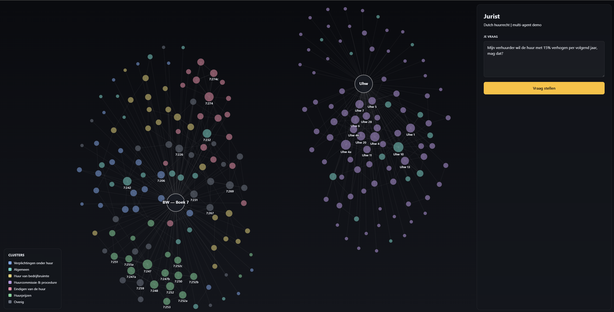

# Jurist

Grounded Dutch **huurrecht** (tenancy-law) Q&A — a small multi-agent demo. Every citation is a real BWB article or ECLI, every answer goes through a post-hoc grounding check, and the whole pipeline streams over SSE so the UI can narrate each step.



**Locked demo question:** *"Mijn verhuurder wil de huur met 15% verhogen per volgend jaar, mag dat?"*

## Status

**M5 on master.** The full agent chain runs on live LLMs for the locked question and a 5-question eval suite (3/5 pass as of 2026-04-22 — see `docs/evaluations/2026-04-22-m5-suite-post.md` for the breakdown and known gaps). Everything below is real; nothing is stubbed except the validator, which is deliberately deferred to v2.

Scope is narrow on purpose: one rechtsgebied, one locked question, an otherwise small eval suite. The goal is to show the moving parts of a grounded legal-QA pipeline clearly, not to ship a production product.

## Architecture at a glance

Five agents run sequentially inside `orchestrator.run_question`. Each is a plain Python `async` generator yielding typed `TraceEvent`s — no framework (no LangChain/LangGraph/CrewAI/AutoGen). The only remote vendor is Anthropic; embeddings (`BAAI/bge-m3`) run locally.

```
run_started
  → decomposer           Haiku forced-tool emit_decomposition
                         → sub_questions, concepts, huurtype_hypothese
  → statute_retriever    Sonnet tool-use loop over 218-node KG
                         → cited_articles (BWB)
  → case_retriever       bge-m3 top-150 chunks → 20 ECLIs → Haiku rerank to 3
                         → cited_cases (ECLI)
  → synthesizer          Sonnet messages.stream() with forced emit_answer
                         → StructuredAnswer with closed-set citation enums
                           + post-hoc verify_citations substring check
  → validator_stub       always valid=True (real validator is v2)
run_finished
```

Grounding is enforced at three layers in the synthesizer: per-request JSON-Schema `enum` on `article_id` / `bwb_id` / `ecli`, Pydantic validation, and a strict-substring check against article bodies and case chunks. Failures regenerate once with a Dutch advisory, then hard-fail to `run_failed{reason:"citation_grounding"}`. Retrievers also emit `low_confidence`; when both flag it, the synthesizer takes an early-branch refusal without a normal-path LLM call.

The frontend (React + Zustand + `react-force-graph-2d` + `framer-motion`) subscribes to the SSE stream and animates KG nodes through `default → current → visited → cited`, shows per-agent thinking, streams the answer tokens live, then swaps to the validated `StructuredAnswer` on `run_finished`. The graph groups the two ingested laws (BW Boek 7 and Uhw) into side-by-side clusters anchored by synthetic book-root nodes.

## Corpus

- **218 KG nodes / 283 edges** over Boek 7 title 4 BW + Uitvoeringswet huurprijzen + relevant AMvBs (`data/kg/huurrecht.json`)
- **49,068 chunks across 6,304 cases**, of which **37 are Hoge Raad ECLIs** (`data/lancedb/cases.lance`)

Both are rebuilt from source via the ingest CLIs below — neither is committed to git.

## Stack

- **Backend:** Python 3.11, `uv`, FastAPI + `sse-starlette` on port **8766**
- **Frontend:** Node 20+, Vite on port **5173**, proxies `/api/*` → backend
- **LLMs:** `anthropic` SDK direct — Sonnet 4.6 for reasoning, Haiku 4.5 for structured sub-calls
- **Vector store:** LanceDB + `sentence-transformers` bge-m3 (1024-d, L2-normalized, local)
- **I/O shape:** Pydantic models on every agent boundary; events typed via a `TraceEvent` ADT

## Quickstart

### 1. Install

```bash
uv sync --extra dev          # pulls torch (~2 GB) transitively
cd web && npm install && cd ..
cp .env.example .env         # then set ANTHROPIC_API_KEY
```

### 2. Build the corpora (one-time)

```bash
uv run python -m jurist.ingest --refresh -v       # KG from BWB
uv run python -m jurist.ingest.caselaw -v         # ~20–40 min; bge-m3 downloads ~2.3 GB on first run
```

The API hard-fails at startup if either `data/kg/huurrecht.json` or `data/lancedb/cases.lance` is missing, so run both before `uvicorn`.

### 3. Run

```bash
uv run python -m jurist.api      # terminal 1 — backend on :8766
cd web && npm run dev            # terminal 2 — frontend on :5173
```

Open `http://localhost:5173`, ask the locked question, and watch the trace.

## Common commands

| Task | Command |
|---|---|
| Full unit suite (~75s) | `uv run pytest -v` |
| Single test | `uv run pytest tests/api/test_orchestrator.py -v` |
| Lint | `uv run ruff check .` |
| Typecheck frontend | `cd web && npx tsc --noEmit` |
| Eval suite (live LLMs) | `uv run python scripts/eval_suite.py --label post` |
| HR coverage audit | `uv run python scripts/audit_hr_coverage.py` |
| Priority-ECLI ingest | `uv run python -m jurist.ingest.caselaw --priority-eclis data/priority_eclis/huurrecht.txt` |
| Re-filter cache only | `uv run python -m jurist.ingest.caselaw --refilter-cache` |

E2E tests that call Anthropic are gated on `RUN_E2E=1` — never run automatically.

## Where to read next

- **Design spec (authoritative):** `docs/superpowers/specs/2026-04-17-jurist-v1-design.md`
- **Milestone plans:** `docs/superpowers/plans/YYYY-MM-DD-*.md`
- **Eval results:** `docs/evaluations/`
- **Developer notes / conventions / env quirks:** `CLAUDE.md`
